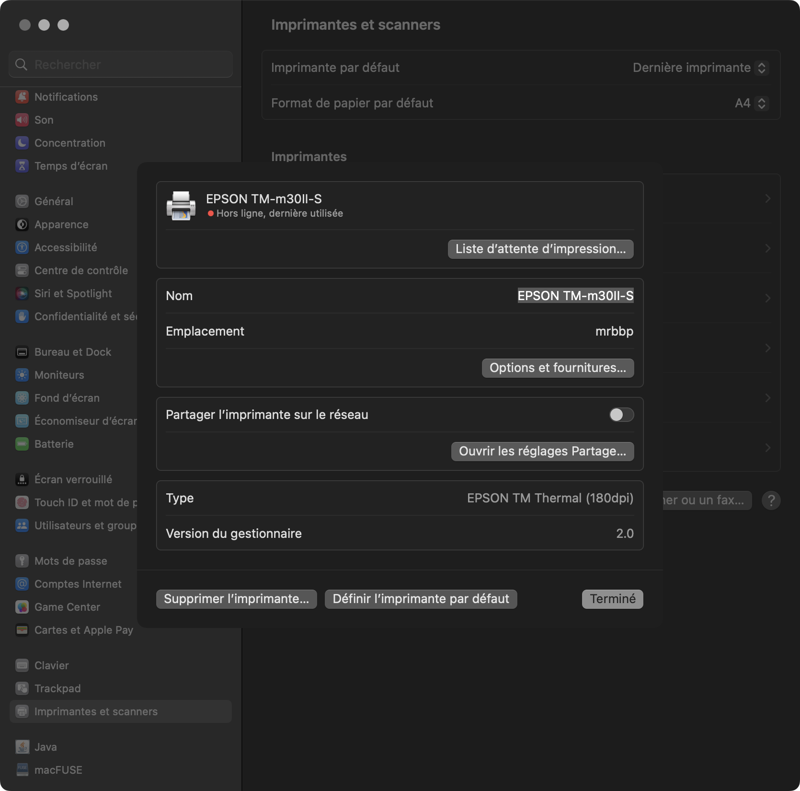
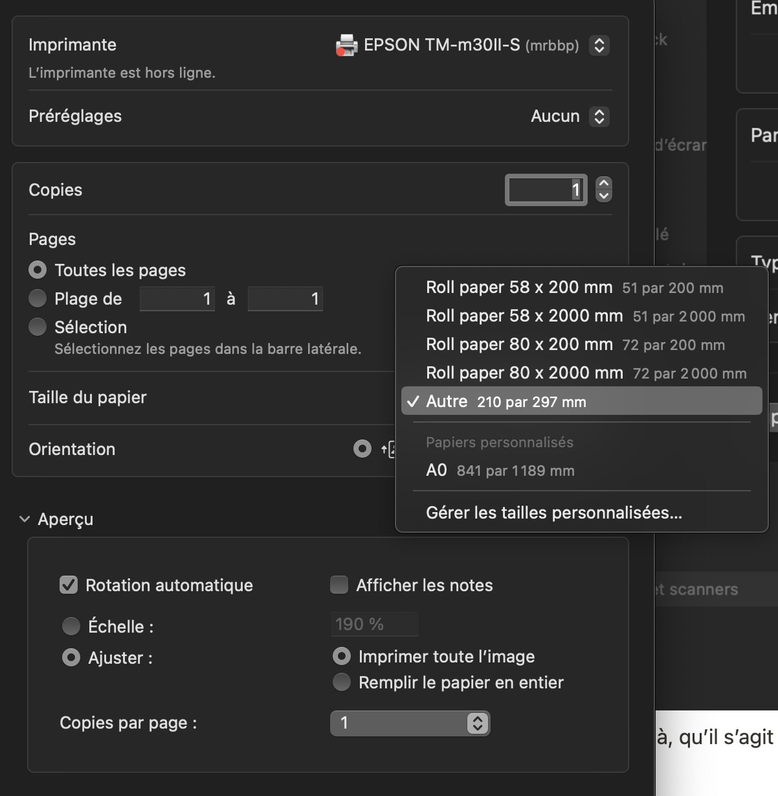
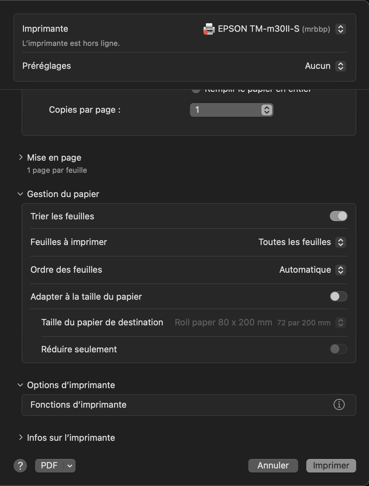
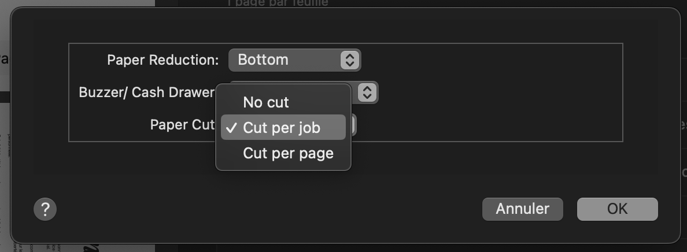

# Édulab Jour 1

Created: 28 mars 2023 19:08
Tags: DN3, exploration, numérique, tech

## L’imprimante à ticket EPSON

Le modèle annoncé est TM-m30

l’imprimante est bluetooth, un voyant clignote au démarrage.

Problème, si le mac (macOS Ventura) détecte bien l’imprimante comme étant une imprimante Thermique, est capable de s’y connecter. Il n’y pas moyen de la sélectionner comme imprimante blutooth.

Après qlq recherches, il apparait que le modèle possède une prise usb et un port ethernet qui n’est pas visible dans la configuration physique de la bête. Il s’avère que l’imprimante est enchassée dans une boite “socle” qui permet de connecter un device de type tablette, sans doute pour transformer une tablette en caisse enregistreuse.

Il y a bien un peu cable usb (micro-usb) qui dépasse du socle, il permet d’alimenter mais rien de plus… Fausse piste.

Après avoir tourné et retourné la bête est avoir tenté d’enfoncer nos doigts dans tous ses orifices. un pan de plastique fini par bouger et la configuration se dévoile.

Il s’agit bien d’une boite-socle, qui contient l’imprimante TM-m30 et son alimentation TP-180 (seule référence qui apparaisse quand on retourne la bête).

Au fond de la boite se révèle 2 port USB-A dont un est connecté au micro-usb qui est visible près du socle, un port ethernet, une prise exotique de type  “sVideo” (les plus vieux comprendront peut-être) et une prise USB-type B (les groses des imprimantes) standard.

Nouveau trouver un cable imprimante usb…

En fouillant les boites de kit arduino nous trouvons notre bonheur.

On cable, on referme la trappe, on repose l’imprimante.

### Acte 2 :

Installation des drivers. puis ajout de l’imprimante dans les Réglages systèmes. Ô miracle, elle est là!

On apprend par là, qu’il s’agit d’une imprimante **TM-m30II-S** et qu’elle dispose d’une résolution de **180 dpi.**

Un premier essai tout à fait pitoyable, d’un document A4 multipage, est imprimé en quelques secondes et 2m de papier. Les pages sont lardées en tronçons de quelques centimètres.

Clara nous prête sa règle kawaï et nous notons:

- largeur du papier 80 mm
- marge : 10 mm

Un deuxième essai est aussitôt fait avec un document au bon format, exporté en pdf. Depuis “Aperçu”, on lance l’impression en sélectionnant la taille du papier.

Il reste des chose à éclaircir encore et à experimenter.

Notre rouleau mesure bien 80 mm, mais comme c’est un rouleau, il est infini, hors le driver nous propose 2 longueurs : 200 ou 2000 mm. et nous n’avons pas retrouvé l’option pour couper le ticket à la fin (je suis sûr de l’avoir vu dans une liste sur la machine de Louis ou depuis une autre interface d’impression).

Autre information à vérifier :

- Les marges d’impression sont de 4 mm??? *(80 - 72)/2*

Les premiers tests ne coupaient pas le papier en fin d’impression, hors sur windows c’est possible.

Après une recherche sur les fonctions de l’imprimante, on a bien la possibilité de couper le papier en fin de job ou en fin de page.
Sur macOS Ventura, j’ai accès à l’option. Sur macOS Monterey, Louis ne la trouve pas.

### réf. :

[support Epson TM-m30](https://www.epson.fr/fr_FR/support/sc/tm-m30/s/s2435)

[configuration d'une TM-m30 (on voit les ports usb)](https://retail-support.lightspeedhq.com/hc/fr/articles/360045848374-Configuration-d-une-imprimante-de-re%C3%A7us-Epson-TM-m30-USB-)

[le manuel pour démonter la TM-m30 (ouverture des trapes)](https://www.epson-biz.com/manuals/tm-m30/en/chap06_2.html#S-0600-0100-00200)

[installation de l'imprimante sur macos](https://support.vendhq.com/hc/fr-ca/articles/360001114656-Configuration-de-votre-imprimante-Epson-TM-m30II-et-TM-m30II-NT-RL-)

réf. :

[installation extension inkscape sur macos Ventura](https://wiki.evilmadscientist.com/Axidraw_Software_Installation#For_recent_macOS.2C_10.13.2C_up_through_macOS_13_Ventura)

[Processing et axidraw - du code pour piloter l'axidraw (un peu âpre)](https://github.com/evil-mad/AxiDraw-Processing)

[un tread pour utilser l'axidraw avec des typos (pas lu)](https://discourse.processing.org/t/drawing-a-font-in-code-axidraw-processing/18344/10)
