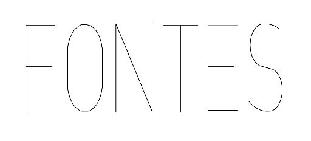
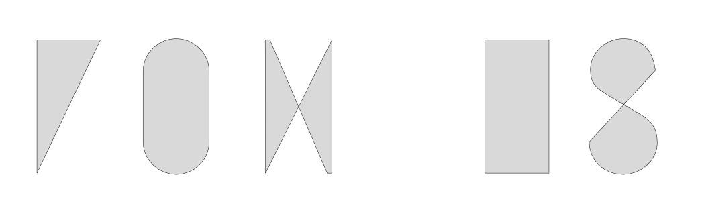
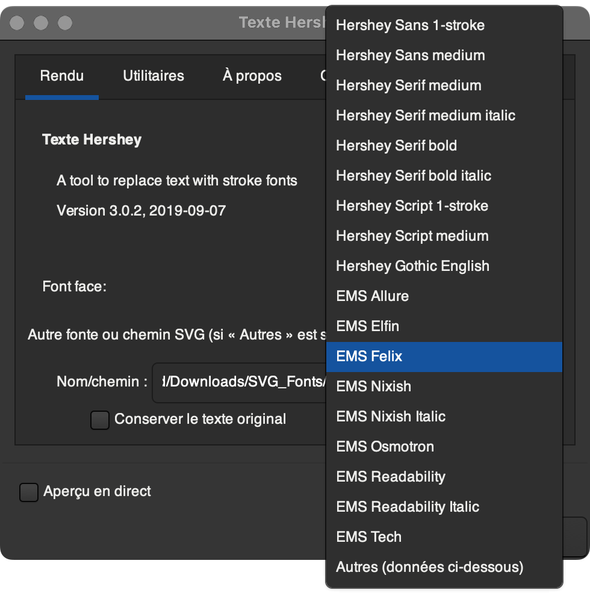
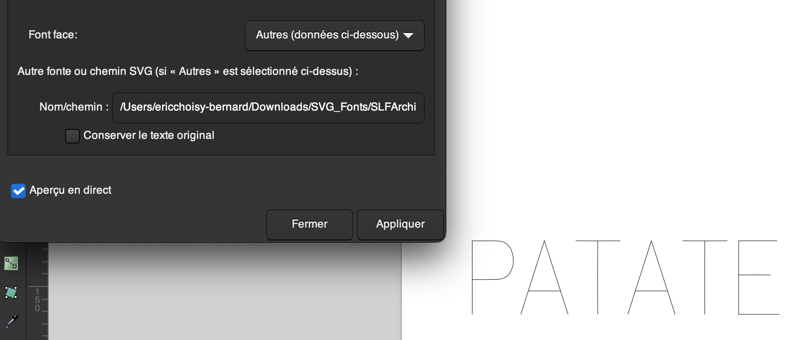

# Édulab Jour 2

Created: 4 avril 2023 09:14
Tags: DN3, exploration, numérique, tech

## Les polices SLF (Single Line Font)

sont des typos utilisées pour les cnc et les découpeuses laser.

Ce sont des polices de caractère définies par un seul tracé ouvert. Dans le cas d’une découpe laser, il n’y a qu’un seul passage du faisceau contrairement à une police “standard” qui est définie par une forme pleine.

Il existe plusieurs formats spécifiques pour les plotters de découpe mais ces derniers ne sont pas pris en charge par les logiciels de gestionnaires de fontes.

Suivant les fichiers (les opentype *.otf* ou trueType *.ttf*) certains dessins s’affichent correctement. Les dessins de lettres sont d’un seul trait.



La OLF ModernNarrow dans Affinity Designer

Parfois la fonte affiche une forme fermée et pleine et les tracés à l’intérieur des formes disparaissent



Orachtech1L dans Affinity Designer

Il arrive parfois que des lettres disparaissent sans qu’on puisse en comprendre la raison, la SLF Architect Condensed perd ses `i` et ses `l`minuscules (les simples traits).

## Inkscape et l’extension “Texte Hershey”

Dans Inkscape, il existe une extension, “Texte Hershey” qui remplace les blocs textes par des fontes svg monoligne. Les fonts svg sont un format de description de fonte en format ouvert et “lisible”. On peut les produire avec les convertisseurs en ligne.

```xml
<glyph glyph-name="A" unicode="A" horiz-adv-x="617"
d="M590 0l-279 700h-5l-279 -700l279 700h5zM506 211h-395h37h-37h395z" />
    <glyph glyph-name="B" unicode="B" horiz-adv-x="578"
d="M329 368q38 0 69 12.5t53.5 35t35 54t12.5 70.5q0 77 -49 118.5t-140 41.5h-248v-700h243q116 0 176 48.5t60 138.5q0 88 -55.5 134.5t-155.5 46.5h-268h268q100 0 155.5 -46.5t55.5 -134.5q0 -90 -60 -138.5t-176 -48.5h-243v700h248q91 0 140 -41.5t49 -118.5
q0 -39 -12.5 -70.5t-35 -54t-53.5 -35t-69 -12.5v0z" />
    <glyph glyph-name="C" unicode="C" horiz-adv-x="640"
d="M610 527q-23 88 -90.5 135t-167.5 47q-65 0 -120.5 -22t-96.5 -66t-64.5 -111.5t-23.5 -159.5t23.5 -159.5t64.5 -112t96.5 -66.5t120.5 -22q100 0 167.5 47.5t90.5 135.5q-23 -88 -90.5 -135.5t-167.5 -47.5q-65 0 -120.5 22t-96.5 66.5t-64.5 112t-23.5 159.5
t23.5 159.5t64.5 111.5t96.5 66t120.5 22q100 0 167.5 -47t90.5 -135v0z" />
```



L’extension propose quelques fontes (des linéales, des mécanes, et des anglaises (script)). On a aussi la possibilité de choisir `Autres (données ci-dessous)` et de renseigner le chemin vers le fichiers (c’est un peu la misère sur macOS, via un `Command + I` avec le fichier svg sélectionné et un copier-coller de l’emplacement du fichier).



C’est une solution fonctionnelle mais peu élégante (pour des graphistes).

## Ajouter des Fontes svg dans Inkscape (fail)

J’ai tenté d’installer des fontes produites avec un convertisseur, en fouillant dans le package de l’application (`/Applications/Inkscape.app/Contents/Resources/share/inkscape/extensions`) et en ajoutant les fontes dans le dossier de Inkscape dans le dossier système de la Bibliothèque `/Users/xxx/Library/Application Support/org.inkscape.Inkscape/config/inkscape/extensions` (ça ne parlera qu’aux geeks).

MacOS Ventura (et depuis quelques versions) dispose d’une protection qui empêche les fichiers ajoutés au système d’être pris en compte sans redémarrage ou via une instruction dans [Terminal.app](http://Terminal.app) qui réinitialise le cache (mais je ne m’en souviens plus et je n’ai pas eu envie de redémarrer la machine).

Bref l’ajout de fichiers dans les dossiers des fontes svg ne fonctionne pas pour le moment.
