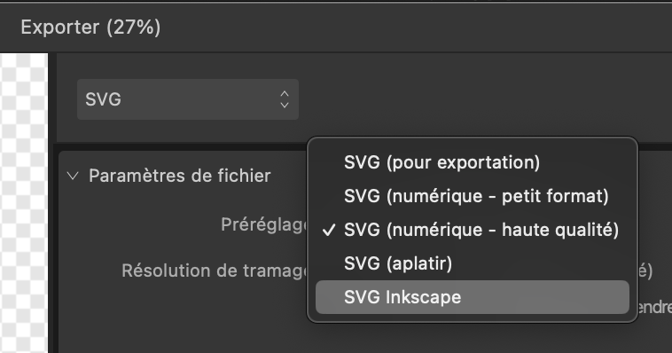

# Édulab Jour 3

Created: 10 avril 2023 16:23
Tags: DN3, exploration, numérique, tech

## Document SVG à la bonne dimension

### AFFINITY Designer vs Inkscape

Le format `svg` est le format standard pour passer d’une app à l’autre en vectoriel, entre nos applications “professionnelles” (on dira plus simplement “propriétaires”) et les outils open source qui sont utilisés avec l‘axidraw, j’ai nommé le terrible Inkscape.

Inkscape travaille nativement avec les formats `svg` et permet de les imprimer avec le plotter (l’axidraw) ou les découper avec la laser.

Mais pour une raison qui m’échappait les dimensions n’étaient pas les mêmes entre un format mesuré comme étant en A3 dans Affinity Designer et passé dans Inkscape. Ce dernier affichait des dimensions autres et forcément pas les bonnes (et que je te mets des messages longs comme le bras pour te dire que les dimensions ne sont pas correctes)


Réglages du document dans Affinity Designer


Fenêtre d’export SVG  d’Affinity Designer

En export de fichiers en `SVG`, Affinity Designer propose plusieurs pré-réglages. Les versions proposées actives ou non des cases à cocher dans l’onglet `Avancé` et modifie les résolutions de sortie.

- `SVG (aplatir)` rasterize les vecteurs. Il transforme les courbes en image avec les datas embarquées dans le svg (base64). Je ne comprends pas l’intérêt de faire une image d’un vectoriel…
- `SVG (numérique - haute qualité)` et `SVG (numérique - petit format)` change la résolution de sortie (300 ou 72) ainsi que pour la rasterization des images générées lorsque l’effet utilisé n’est pas transposable en svg (tous les effets de pinceaux et de couleur sans doute)
- `SVG (pour exportation)` rien de coché, pas de résolution de sortie.

Inkscape crée des documents svg dans l’unité demandée, dans l’exemple ici, un A3 en mm et donc le viewbox reprend les valeurs chiffrées. À l’ouverture dans AD (Affinity Designer), le document est à la bonne dimension. Mais, si on modifie le fichier et qu’on l’exporte en svg avec les pré-réglages d’AF, arrivé dans Inkscape, le fichier n’est plus au bon format.

```svg
<?xml version="1.0" encoding="UTF-8" standalone="no"?>
<!-- Created with Inkscape (http://www.inkscape.org/) -->

<svg
   width="297mm"
   height="420mm"
   viewBox="0 0 297 420"
   version="1.1"
   id="svg2490"
   inkscape:version="1.2.1 (9c6d41e4, 2022-07-14)"
   sodipodi:docname="A3 inkscape.svg"
   xmlns:inkscape="http://www.inkscape.org/namespaces/inkscape"
   xmlns:sodipodi="http://sodipodi.sourceforge.net/DTD/sodipodi-0.dtd"
   xmlns="http://www.w3.org/2000/svg"
   xmlns:svg="http://www.w3.org/2000/svg">
  […]
  <defs
     id="defs2487" />
  <g
     inkscape:label="Calque 1"
     inkscape:groupmode="layer"
     id="layer1" />
</svg>
```

```svg
<?xml version="1.0" encoding="UTF-8" standalone="no"?>
<!DOCTYPE svg PUBLIC "-//W3C//DTD SVG 1.1//EN" "http://www.w3.org/Graphics/SVG/1.1/DTD/svg11.dtd">
<svg width="100%" height="100%" viewBox="0 0 842 1191" version="1.1" xmlns="http://www.w3.org/2000/svg" xmlns:xlink="http://www.w3.org/1999/xlink" xml:space="preserve" xmlns:serif="http://www.serif.com/" style="fill-rule:evenodd;clip-rule:evenodd;stroke-linejoin:round;stroke-miterlimit:2;">
</svg>
```

```svg
<?xml version="1.0" encoding="UTF-8" standalone="no"?>
<!DOCTYPE svg PUBLIC "-//W3C//DTD SVG 1.1//EN" "http://www.w3.org/Graphics/SVG/1.1/DTD/svg11.dtd">
<svg width="100%" height="100%" viewBox="0 0 3508 4961" version="1.1" xmlns="http://www.w3.org/2000/svg" xmlns:xlink="http://www.w3.org/1999/xlink" xml:space="preserve" xmlns:serif="http://www.serif.com/" style="fill-rule:evenodd;clip-rule:evenodd;stroke-linejoin:round;stroke-miterlimit:2;">
</svg>
```

Si on ausculte le fichier dans un éditeur, le document n’a plus d’unité, la `width`et la `height` sont à `100%` et le `viewBo`  contient d’autres valeurs. Suivant les pré-réglages, la dimension de la viewBox est différente.

Il se trouve qu’en modifiant de façon empirique les réglages d’export, j’ai enfin obtenu un document qui conserve sa dimension (ou presque) entre AD et Inkscape.

Il faut exporter avec la résolution `96dpi`, je ne sais pas•plus pourquoi, mais c’est comme ça.

### Créer un préréglage en 96DPI dans AD

Maintenant le grand jeu, c’est de se faire un pré-réglage pour ne pas toujours refaire les réglages (je préfère transformer les textes en courbes pour la découpeuse et éviter les pb de typo entre Os).

Dans `Affinity Designer`, pour se créer un pré-réglage, ça se passe dans l’onglet `Export Persona`, il faut dessiner une tranche et régler les options d’export de la tranche. Une fois fait, dans le burger menu à droite, s’active la ligne `Créer un préréglage`. Il suffit de donner un nom et il sera maintenant présent dans la liste des préréglages d’export.

Je vous montre les réglages que j’utilise, le plus important c’est la `Résolution` de **96dpi** et sans doute d’**aplatir les transformations** pour éviter d’avoir du code inutile sur les groupes. Comme dit plus haut, je transforme les textes en courbe, pour éviter les pb de typo d’un OS à l’autre. (je bosse sur MacOS, l’axidraw de l’édulab est branché sur un WinXX)




Oh mon préréglagei


Le document A3 (dans AD) ouvert dans Inkscape est bien en A3 (ou presque)

Ok, encore un truc de réglé.
